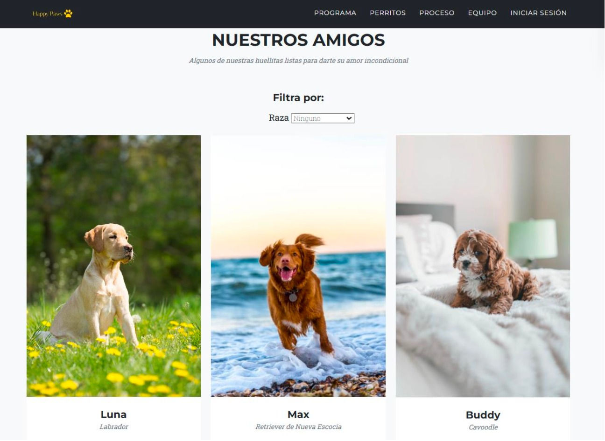
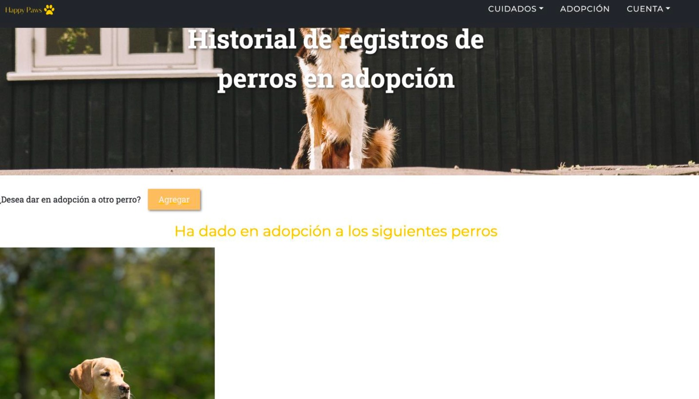
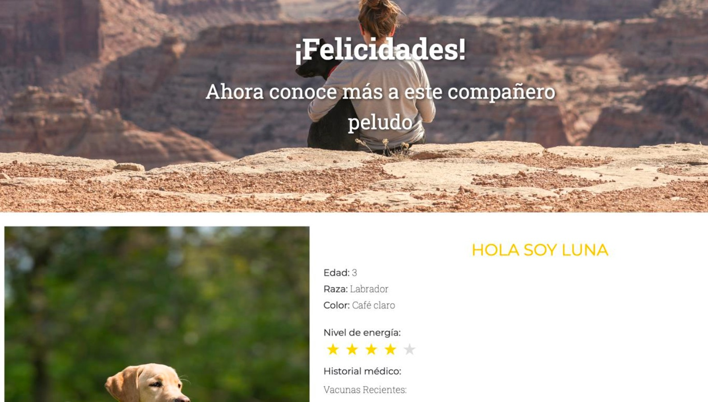

# HappyPaws
Dogs adoption website

A dog adoption website is a dedicated online platform that connects potential pet owners with dogs in need of a loving home. The website features a user-friendly interface designed to make the adoption process simple and accessible for everyone.

# Technologies used
- HTML5: Used for structuring the web pages.
- CSS3: Used for styling and layout.
- JavaScript: Used for dynamic and interactive features.
- [NodeJs](https://nodejs.org/en): Used to run JavaScript code on the server-side.
- [Bootstrap](https://getbootstrap.com/): Used for responsive design and UI components.
- [Font Awesome](https://fontawesome.com/): Used for icons.

# Dependencies
To run this project properly you need to install the next dependencies:
- [Express]: Used to interact with the database.
- [Multer]: Used to interact with the database.
- [Cors]: Used to interact with the database.
- [Mongoose]: Used to interact with the database.
- [bcrypt]: Used to encrypt all the users passwords to save in the database.
You can install the dependencies with the next command: `npm i` and the name of the dependecie.

# Mockup application

# Usage
Steps to use the web page properly:
- In your favorite code editor clone the repository with the command:
`git clone https://github.com/arlynmedina/WebPage.git`
- Install the dependices from before
- Run the server with the command: `node server.js`
- Open the index.html (Live server is recommend)
Thats can you use the webpage
