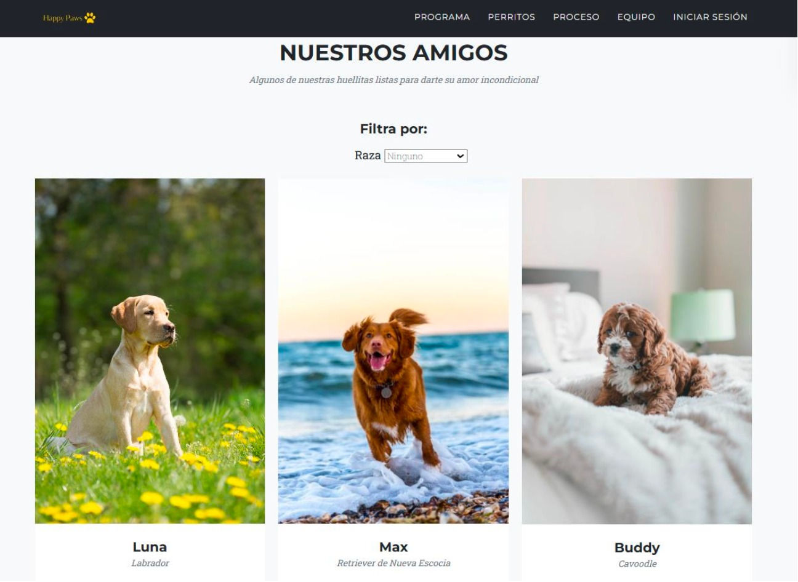
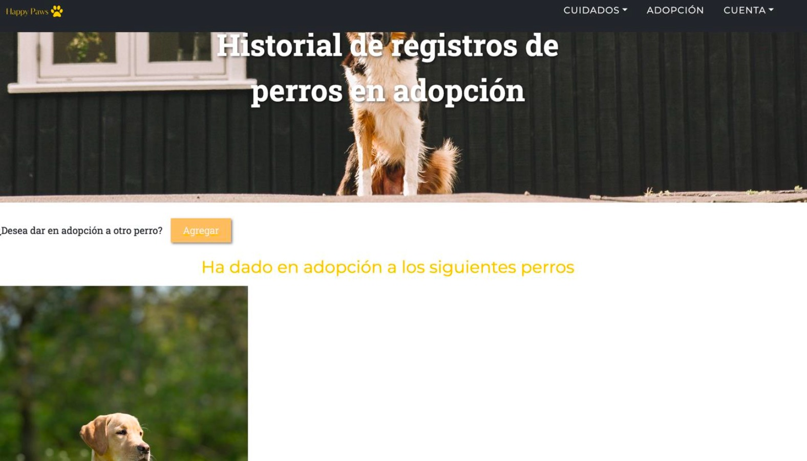
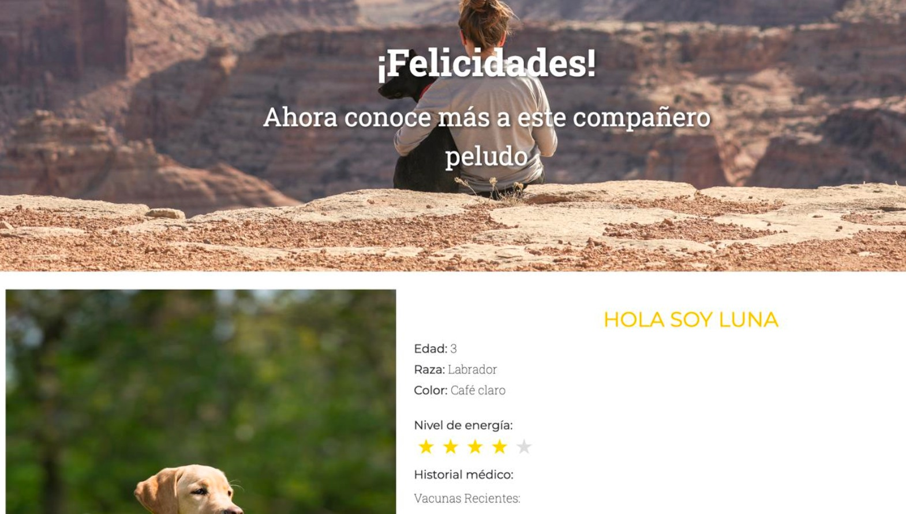

# HappyPaws
Dogs adoption website

A dog adoption website is a dedicated online platform that connects potential pet owners with dogs in need of a loving home. The website features a user-friendly interface designed to make the adoption process simple and accessible for everyone.

# Technologies used
- HTML5: Used for structuring the web pages.
- CSS3: Used for styling and layout.
- JavaScript: Used for dynamic and interactive features.
- [NodeJs](https://nodejs.org/en): Used to run JavaScript code on the server-side.
- [Bootstrap](https://getbootstrap.com/): Used for responsive design and UI components.
- [Font Awesome](https://fontawesome.com/): Used for icons.

# Dependencies
To run this project properly you need to install the next dependencies:
- [Express]: Used to interact with the database.
- [Multer]: Used to interact with the database.
- [Cors]: Used to interact with the database.
- [Mongoose]: Used to interact with the database.
- [bcrypt]: Used to encrypt all the users passwords to save in the database.
You can install the dependencies with the next command: `npm i` and the name of the dependecie.
- [Selenium]: Used for end-to-end testing by automating browser interactions to simulate real user behavior.
- [Jest]: Used for unit tests to validate the functionality of individual components and modules.
- [Supertest]: Used to simulate HTTP requests to the Express app for testing API endpoints without starting a real server.

# Usage
Steps to use the web page properly:
- In your favorite code editor clone the repository with the command:
`git clone https://github.com/arlynmedina/WebPage.git`
- Install the dependices from before
- Run the server with the command: `node server.js`
- Open the index.html (Live server is recommend) or you can run the app with docker (see instructions below).

# Requirements
## User Registration
- As a user, I want to be able to create a personal account and have the chance to become a certified user.
- When registering as a certified user, the application must collect personal information, including:
  • Full name  
  • Contact details (phone number, email)  
  • Address
- As a certified user, I can publish dog profiles for them to be adopted.
- When wanting to adopt a dog after seeing its profile, I am able to see the information of the person that is putting it up for adoption.

## Pet Profiles
- Each pet profile should include Name, Age, Breed, Size, Gender, Key Characteristics, high-quality photos, Personality, and behavior details.

## Search and Filters
- As a user, I can search for pets using the filter of race.
- As a user, I can search for specific information about a certain breed to get more knowledge before adopting.

# Run/Start application
Build image:
- `docker build . -t front-app-happy-paws`

Run application:
- `docker run -d -p 80:80 front-app-happy-paws`

Run backend locally:
- node server.js

# Mockup application

# To Contribute
1. **Create a new branch** from the `development` branch.
2. **Make your modifications** and ensure all tests pass.
3. **Push your branch** to the remote GitHub repository.
4. **Open a Pull Request (PR)** against the `development` branch.
5. Once the PR is **reviewed and approved by another contributor**, it can be **merged into `development`**.

