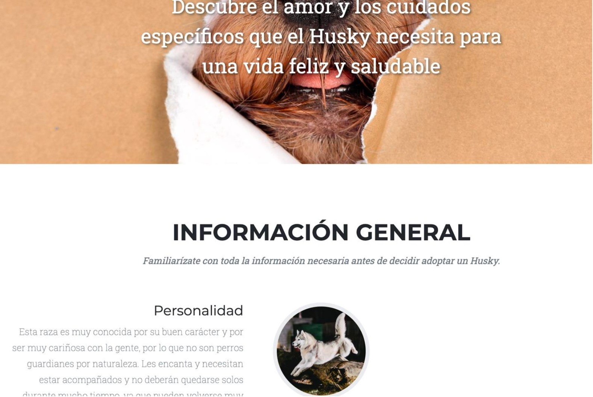

# HappyPaws
Dogs adoption website

A dog adoption website is a dedicated online platform that connects potential pet owners with dogs in need of a loving home. The website features a user-friendly interface designed to make the adoption process simple and accessible for everyone.

# Technologies used
- HTML5: Used for structuring the web pages.
- CSS3: Used for styling and layout.
- JavaScript: Used for dynamic and interactive features.
- [NodeJs](https://nodejs.org/en): Used to run JavaScript code on the server-side.
- [Bootstrap](https://getbootstrap.com/): Used for responsive design and UI components.
- [Font Awesome](https://fontawesome.com/): Used for icons.

# Dependencies
To run this project properly you need to install the next dependencies:
- [Express]: Used to interact with the database.
- [Multer]: Used to interact with the database.
- [Cors]: Used to interact with the database.
- [Mongoose]: Used to interact with the database.
- [bcrypt]: Used to encrypt all the users passwords to save in the database.
You can install the dependencies with the next command: `npm i` and the name of the dependecie.
- [Selenium]: Used for end-to-end testing by automating browser interactions to simulate real user behavior.
- [Jest]: Used for unit tests to validate the functionality of individual components and modules.
- [Supertest]: Used to simulate HTTP requests to the Express app for testing API endpoints without starting a real server.

# Usage
Steps to use the web page properly:
- In your favorite code editor clone the repository with the command:
`git clone https://github.com/arlynmedina/WebPage.git`
- Install the dependices from before
- Run the server with the command: `node server.js`
- Open the index.html (Live server is recommend) or you can run the app with docker (see instructions below).

## Requirements

### User Registration

• As a user, I want to be able to create an account  
• As an adopter, I want the application to ask for my personal  
information (such as name, contact details, address, etc.) when  
creating an account, so that my profile is complete and I can be  
contacted for adoption opportunities  

### Pet Profiles

• As an adopter, I want each pet to have its own profile that includes  
essential information such as name, age, breed, size, and gender, so  
that I can make an informed decision about adoption  
• As an adopter, I want pet profiles to contain information about the  
pet’s health status and vaccinations, so that I can ensure the pet is  
healthy before adopting  
• As an adopter, I want pet profiles to include details about the pet’s  
personality and behavior, so that I can assess if the pet is a good fit  
for my home  
• As an adopter, I want pet profiles to indicate any special requirements  
(such as dietary needs or medical attention), so that I can provide  
proper care for the pet once adopted  

### Search and Filters

• As an adopter, I want to be able to search for pets by type of animal,  
so that I can find pets that meet my preferences  
• As an adopter, I want to be able to filter pets based on special  
characteristics (such as behavior, medical needs, etc.), so that I can  
find pets with specific traits that align with my needs  

### Direct Contact with Shelters or Owners

• As an adopter, I want to be able to contact shelters or pet owners  
directly by phone number or email, so that I can ask questions or  
arrange for adoption details  
• As an adopter, I want to complete an adoption application form  
through the application, so that I can formally express my interest in  
adopting a pet  

---

## Tech Stack

### Programming Languages

• HTML5: Used for structuring web pages.  
• CSS3: Used for styling and layout.  
• JavaScript: Used for dynamic and interactive features.  
• NodeJs: Used to run JavaScript code on the server-side.  
• Bootstrap: Used for responsive design and UI components.  
• Font Awesome: Used for icons.  
• [Express]: Used to interact with the database.  
• [Multer]: Used to interact with the database.  
• [Cors]: Used to interact with the database.  
• [Mongoose]: Used to interact with the database.  
• Jest  
• Codecept js: functional testing  
• Playright  
• [bcrypt]: Used to encrypt all the users passwords to save in the  
database. You can install the dependencies with the next command:  
`npm i` and the name of the dependencies.

### Coding standars

▪ Camel case  

### Pathern Design

▪ MVC  

---

## Repositories

• Link: https://github.com/Yamilecg/HappyPaws  
• Branch Strategy: Github Flow  

### Branches

▪ main  
▪ development  
▪ Feature branches (created from dev)  

---

## Unit Tests

### Admin.test.js  
https://github.com/Yamilecg/HappyPaws

#### GET /admins

1. "The One Where the API Returns a List of Admins (200 OK)"  
2. "The One Where the Database Query Fails (500 Error)"  

#### GET /admins/:id

1. "The One Where a Valid Admin ID Returns the Correct Admin (200 OK)"  
2. "The One Where an Invalid Admin ID Returns a 404 Not Found"  
3. "The One Where an Unexpected Error Breaks the Admin Lookup (500 Error)"  

#### POST /admins

1. "The One Where a New Admin Gets Created Successfully (201 Created)”  
2. "The One Where a Required Field Is Missing (400 Bad Request)"  
3. "The One Where Something Goes Wrong Unexpectedly (400 Bad Request)"  

### archivo.js

#### POST /upload

1. "The One Where a File Upload Succeeds (200 OK)"  

### dogs.js

#### GET /dogs

1. "The One Where the API Returns a List of Dogs (200 OK)"  
2. "The One Where the Database Query Fails (500 Error)"  

#### GET /dogs/:name

1. "The One Where the API Returns a Specific Dog (200 OK)"  
2. "The One Where the Dog Is Not Found (404 Error)"  
3. "The One Where the Database Query Fails (500 Error)"  

#### GET /dogs/id/:id

1. "The One Where the API Returns a Specific Dog by ID (200 OK)"  
2. "The One Where the ID Is Invalid (400 Error)"  
3. "The One Where the Database Query Fails (500 Error)"  

#### DELETE /dogs/id/:id

1. "The One Where the Dog Is Successfully Deleted (200 OK)"  
2. "The One Where the ID Is Invalid (400 Error)"  
3. "The One Where the Dog Is Not Found (404 Error)"  
4. "The One Where the Database Query Fails (500 Error)"  

#### POST /dogs

1. "The One Where the Dog Is Successfully Created (200 OK)"  
2. "The One Where a Required Field Is Missing (400 Error)"  
3. "The One Where the Database Query Fails (400 Error)"  

### users.js

#### GET /users

1. 200 OK  
2. 500 Internal Server Error  

#### GET /users/:email

1. 200 OK  
2. 404 Not Found  
3. 500 Internal Server Error  

#### GET /users/:email/:password

1. 200 OK  
2. 404 Not Found  
3. 500 Internal Server Error  
4. 500 Internal Server Error  

#### POST /users

1. 201 Created  
2. 400 Bad Request  
3. 400 Bad Request  

#### PUT /users/:email

1. 200 OK  
2. 404 Not Found  
3. 500 Internal Server Error  

#### PUT /users/updateList/:email

1. 200 OK  
2. 404 Not Found  
3. 500 Internal Server Error  

---

## Info.js

### GET /infodogs

1. 200 OK  
2. 500 Internal Server Error  

### GET /infodogs/:raza

1. 200 OK  
2. 404 Not Found  
3. 500 Internal Server Error  

---

## Integration Tests

### AuthenticateUser.test.js

1. 200 OK  
2. 404 Not Found  
3. 401 Unauthorized  

### newAdmin.test.js

- GET / (MongoDB Connection Test)  
- POST /admins (Create New Admin User)  

### newFile.test.js

- POST /upload (MongoDB Connection Test)  

### NewInfo.test.js

- GET /infodogs (MongoDB Connection Test)  
- GET /infodogs (Fetch Dog Breeds)  
- GET /infodogs (Error Handling)  

### PostDog.test.js

- POST /dogs (MongoDB Connection Test)  
- POST /dogs (Create a New Dog)  

---

## Selenium Tests

### Test: dog_care_steps and dog_care.features

1. The user logs in with valid credentials  
2. The user selects the "Dog Care" section  
3. The user selects a breed (e.g., "Chow Chow")  
4. The test verifies the information is displayed correctly  

### Test: filter_dogs_steps and filter_dogs.features

1. The user navigates to the dogs page  
2. The user selects the "Husky" breed in the filter dropdown  
3. The test ensures the breed is correctly displayed  

### Test: User Login

1. Open Login Page  
2. Click Login Button  
3. Enter Email  
4. Enter Password  
5. Submit Login  
6. Verify Login  

### Test Flow: Verify Program Section Content

1. Initialize Setup  
2. Open Browser  
3. Wait for Page Load  
4. Verify Elements  
5. Click on Element  
6. Wait for Element Visibility  
7. Close All Windows  

---

## Stress Testing

- Spike Traffic Test  
- Massive Pet Search Load Test  
- Large Image Upload Stress Test  
- Database Overload Simulation  
- Sustained High Load Test  

---

## Performance Testing

- User Registration Flow Performance  
- Pet Profile Loading Performance  
- Search and Filter Response Performance  
- Adoption Form Submission Performance  
- Direct Contact with Shelters/Owners Performance  

# Run/Start application
Build image:
- `docker build . -t front-app-happy-paws`

Run application:
- `docker run -d -p 80:80 front-app-happy-paws`

Run backend locally:
- node server.js

# Mockup application

# To Contribute
1. **Create a new branch** from the `development` branch.
2. **Make your modifications** and ensure all tests pass.
3. **Push your branch** to the remote GitHub repository.
4. **Open a Pull Request (PR)** against the `development` branch.
5. Once the PR is **reviewed and approved by another contributor**, it can be **merged into `development`**.

